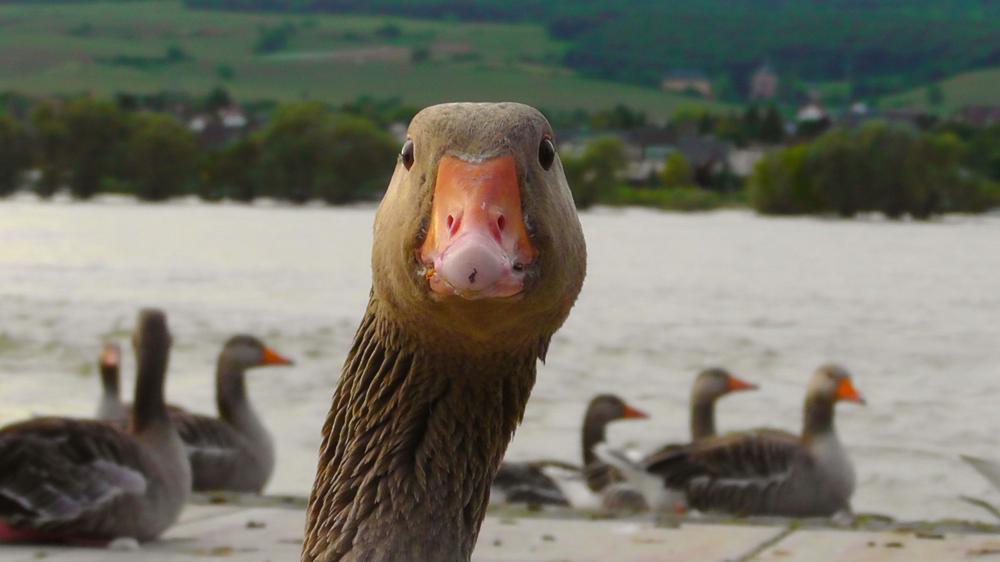
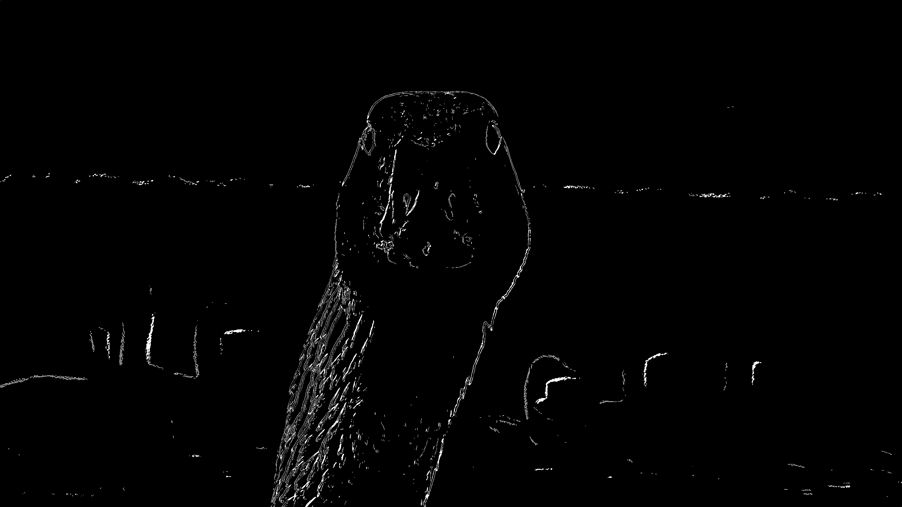

# Canny of the Goose

Canny edge detection written mainly in x64 assembly.

Supports grayscale and RGB images, no support for RGBA. The algorithm is outlined [here](https://en.wikipedia.org/wiki/Canny_edge_detector). Most steps rely on SSE instructions for parallelising the workload.

### Example

    
    

Image courtesy of Pixabay and available [here](https://www.pexels.com/photo/nature-bird-river-head-66863/).

### Hardware Requirements

- An x64 processor supporting at least SSE4.1[^1]

### Dependencies

- Linux -- *for calling convention*
- libc -- *for malloc and free*
- C POSIX -- *for parsing command line arguments*
- [stb image](https://github.com/nothings/stb)[^2] -- *for reading and writing images*

### Credits
- The sobel function is partly based on a chapter in [Introduction to 64 Bit Assembly Language Programming for Linux and OS X](https://www.rayseyfarth.com/asm/index.html) by Ray Seyfarth.
- stb written by Sean Barrett et.al., see [this](https://github.com/nothings/stb/graphs/contributors) for the full list of contributors

### Footnotes
[^1]: Most at least somewhat modern Intel and AMD processors do  
[^2]: Required files included in the include directory
